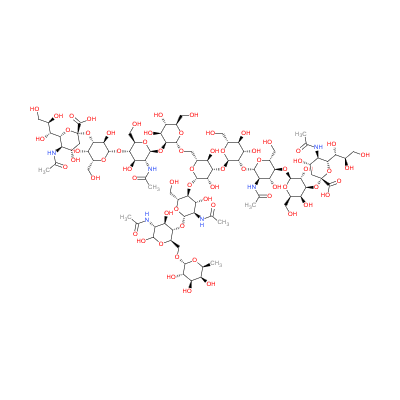

## Overview

Glycan chemical structures can be complex and difficult to interpret, especially when visualized using traditional line drawings. To address this, the Symbol Nomenclature for Glycans (SNFG) system uses standardized colored shapes to represent different monosaccharides, making glycan structures easier to read and compare. Below, the chemical structure of G55818EE is shown alongside its SNFG representation.

<div style="display: flex; justify-content: space-between; align-items: center;">
    <div style="flex: 1; text-align: center;">
        
        <p><em>Chemical structure</em></p>
    </div>
    <div style="flex: 1; text-align: center;">
        
        <p><em>SNFG representation</em></p>
    </div>
</div>


## GlyTouCan and Anomeric Configurations

The GlyTouCan identifier G55818EE represents the archetype structure. The anomeric configuration at the reducing end can vary, resulting in different GlyTouCan accessions:

- **G55818EE** (Archetype) - represents the general structure
- **G29276DW** (α-anomer) - alpha anomeric configuration at reducing end
- **G17689DH** (β-anomer) - beta anomeric configuration at reducing end

This nomenclature system allows for precise identification of glycan structures while accounting for anomeric differences that can significantly impact biological function and structural properties.

## Nomenclature Systems

Multiple nomenclature systems are used to represent this glycan structure, each with specific advantages for different applications:

### IUPAC
```
Neu5Ac(a2-3)Gal(b1-4)GlcNAc(b1-2)Man(a1-3)[Neu5Ac(a2-3)Gal(b1-4)GlcNAc(b1-2)Man(a1-6)]Man(b1-4)GlcNAc(b1-4)[Fuc(a1-6)]GlcNAc
```


### GLYCAM
```
DNeup5Aca2-3DGalpb1-4DGlcpNAcb1-2DManpa1-3[DNeup5Aca2-3DGalpb1-4DGlcpNAcb1-2DManpa1-6]DManpb1-4DGlcpNAcb1-4[LFucpa1-6]DGlcpNAc
```

### Oxford
```
FA2G2S2
```


# Chemical and Biological information

[GlycoShape entry of G55818EE](https://glycoshape.org/glycan?glytoucan=G55818EE)


# Structure


## Simulation @ 300K
<div style="text-align: center;">
    
    <p><em>Simulation of G55818EE glycan dynamics</em></p>
</div>


<div style="display: flex; justify-content: space-between;">
    <div style="flex: 1; padding: 1rem;">
        <h3>Cluster 0</h3>
        <iframe src="https://glycoshape.org/viewer/embedded.html?pdbUrl=https://glycoshape.org/database/GS00152/PDB_format_HETATM/cluster0_alpha.PDB.pdb&format=pdb" width="100%" height="500px" frameborder="0"></iframe>
    </div>
    <div style="flex: 1; padding: 1rem;">
        <h3>Cluster 1</h3>
        <iframe src="https://glycoshape.org/viewer/embedded.html?pdbUrl=https://glycoshape.org/database/GS00152/PDB_format_HETATM/cluster1_alpha.PDB.pdb&format=pdb" width="100%" height="500px" frameborder="0"></iframe>
    </div>
    <div style="flex: 1; padding: 1rem;">
        <h3>Cluster 2</h3>
        <iframe src="https://glycoshape.org/viewer/embedded.html?pdbUrl=https://glycoshape.org/database/GS00152/PDB_format_HETATM/cluster2_alpha.PDB.pdb&format=pdb" width="100%" height="500px" frameborder="0"></iframe>
    </div>
</div>
